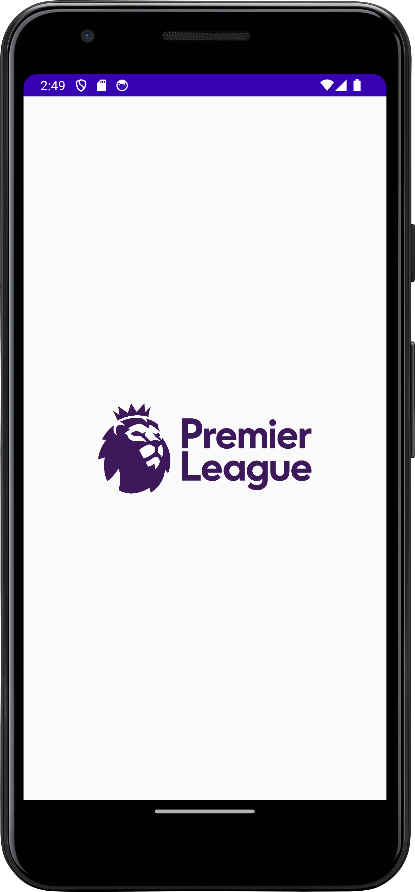
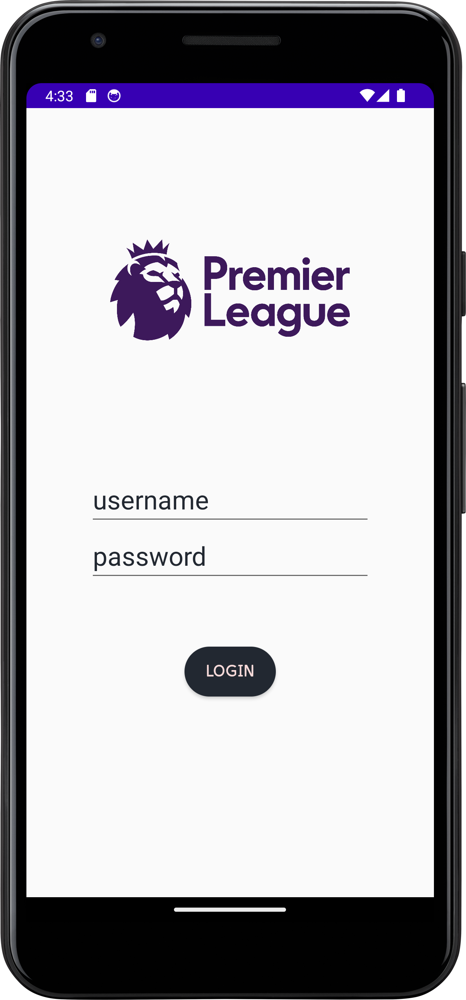
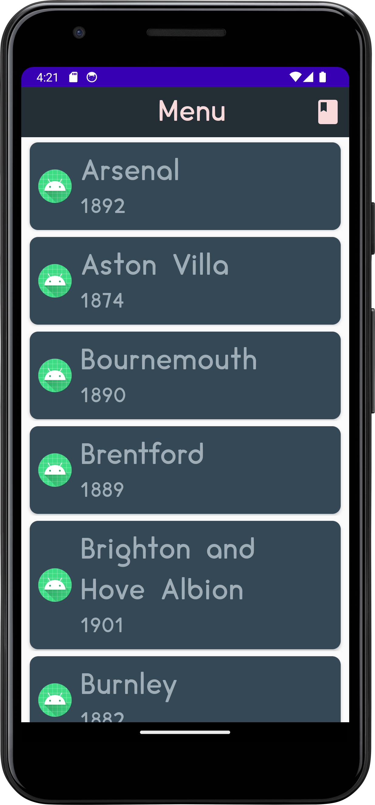
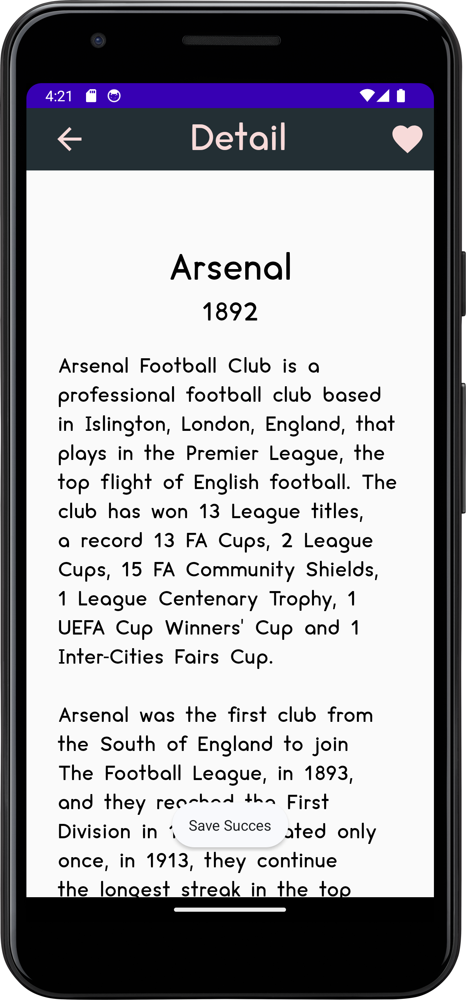
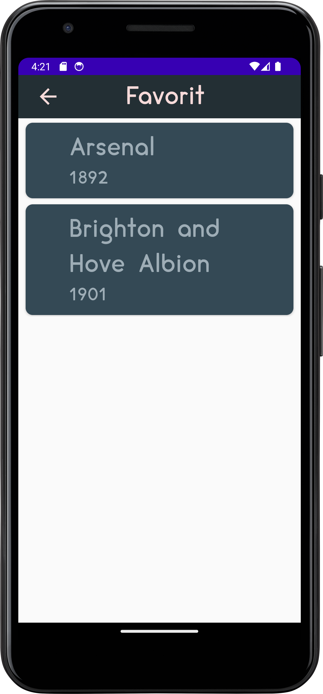

# Premier League Teams App (Java) - Android Educational Project

Nov 8, 2021 | Built in 11th grade this Android app displays Premier League club information with a list → detail flow and lets users save teams to Favorites using Realm. Made to practice RecyclerView, API networking, image loading, and local storage.

---

## Preview (Screenshots)

> Taruh screenshot kamu di folder `docs/` lalu update nama filenya di tabel ini.

Splash | Login | Home / Team List | Team Detail | Favorites |
|---|---|---|---|---|
|  |  |  |  |  |

---

## Features

- Display list of LaLiga teams fetched from API
- Team detail screen (image + description, etc.)
- Add / remove teams to **Favorites**
- Local storage using **Realm Database**
- RecyclerView-based UI + CardView
- Image loading using **Picasso**

---

## Tech Stack

- **Language:** Java
- **Build System:** Gradle
- **UI:** ConstraintLayout, RecyclerView, Material Components, CardView
- **Libraries:**
  - AndroidX AppCompat
  - RecyclerView (+ recyclerview-selection)
  - **AndroidNetworking** (API request)
  - **Picasso** (image loading)
  - **Realm** (local database / favorites)
  - Material Components
- **compileSdk / targetSdk:** 30
- **minSdk:** 21

---

## Project Structure (High Level)

- `app/` - Android application module
- `app/src/main/java/...` - Activities, adapters, models, API & Realm logic
- `app/src/main/res/` - Layouts, drawables, strings, themes
- `gradle/` + `gradlew*` - Gradle wrapper files
- `docs/` - Screenshots for README

---

## Getting Started

### Requirements
- Android Studio (recommended: versi terbaru)
- JDK 11
- Android SDK Platform 30 installed (compileSdk 30)

### Run Locally
1. Clone repository:
   ```bash
   git clone https://github.com/Aryosetowmn/androiddev_kelas11semester1_port2.git
   ```
2. Open project di **Android Studio**
3. Tunggu **Gradle Sync**
4. Run di:
   - Emulator (Device Manager), atau
   - Android device (USB Debugging enabled)

---

## Notes

Repository ini dibuat untuk pembelajaran dan portfolio.

Kalau mau dikembangkan ke standar “real-world app”, kamu bisa pertimbangkan:
- Architecture: MVVM
- Local database: Room (atau tetap Realm tapi rapihin layernya)
- Repository pattern + caching
- Error/loading state yang lebih rapih

---

## Author

**Aryosetowmn**  
Repository: `Aryosetowmn/androiddev_kelas11semester1_port2`
